<div align ='center'>
</div>

- [About the project](#about-the-project)
- [Backend](#backend-information)
- [Frontend](#frontend-information)
- [User Requirements](#user-requirements)
- [API Documention](#api-documention)
- [Use Cases](#use-cases)
- [Usability](#usability)
- [Tech stack and comparison](#tech-stack-and-comparison)
- [Docker Mounting](#docker-mounting)
- [Personal opinion and comparison](#personal-opinion-and-comparison)


</div>
<h1 align='center'>About the project</h1>
<div>
     Eduapp emerges after the covid 19 pandemic, as the answer to the challenges that this entails.
     <br/>
		 <br/>
     It's an european project, co-funded by erasmus+ programme
     <br/>
          <h1>Partners</h1>
          <p>Fundatia Ecologica Green - Romania, Instituto Politécnico de Santarém - Portugal, Stichting Landstede - Netherlands, SOSU OSTJYLLAND - Denmark and IES El Rincón - Spain</p>
          <h1>Objectives</h1>
          <p>Faciliate and increase the communication between school, students and teachers by developing an application, EduApp, free and open source, customised for each partner school.</p>
</div>
  
<h1 align='center'>Backend information</h1>
<p>Eduapp has used postgresQL as database, ruby on rails as server-side web application framework.</p>
<h3>Diagram E/R</h3>
<div >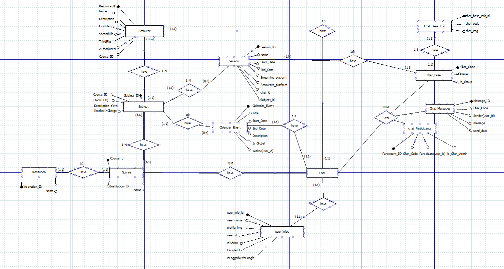
</div>
<h3>Diagram UML</h3>
<div >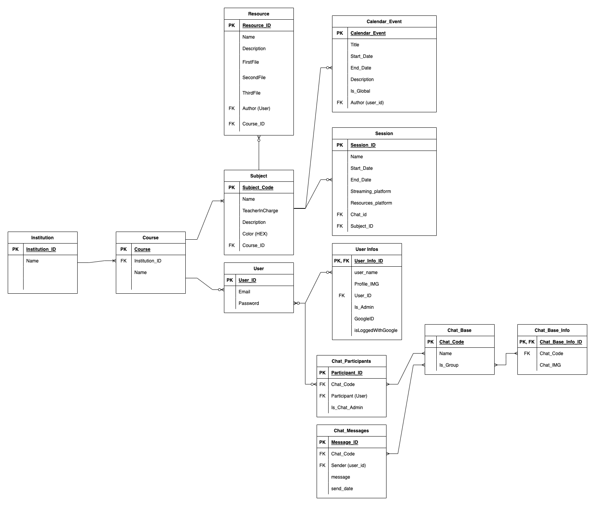
</div>
<h3>Relational diagram:</h3>
<div>
		<p>INSTITUTIONS(ID, name)</p>
		<p>COURSE(ID, name, institution_id*)</p>
		<p>USERS(ID, email, password)</p>
		<p>USER_INFOS(ID, user_name, profile_img, user_id*, is_admin, googleId, isLoggedWithGoogle)</p>
		<p>CHAT_BASES(ID, name, is_group)</p>
		<p>CHAT_BASE_INFOS(ID, chat_base_id*, chat_img)</p>
		<p>CHAT_PARTICIPANTS(ID, chat_base_id*, user_id*, is_chat_admin)</p>
		<p>CHAT_MESSAGES(ID, user_id*, message, send_date)</p>
		<p>SUBJECTS(ID, name, teacherInCharge, description, color, course_id*)</p>
		<p>RESOURCES(ID, name, description, firstfile, secondfile, thirdfile, user_id*, course_id*)</p>
		<p>SESSIONS(ID, name, start_date, end_date, streaming_platform, resources_platform, chat_base_id*, subject_id*)</p>
		<p>CALENDAR_EVENTS(ID, title, start_date, end_date, description, is_global, user_id*)</p>
</div>

<h3>Explanation of the diagrams contents:</h3>
<p>- Events, sessions and resources belong to a subject</p>
<p>- A subject belongs to a course</p>
<p>- A course belongs to an instutition</p>
<p>- A user can enroll into a course, and will access all subjects linked to the course</p>
<p>- A user can participate in a chat if it has been linked to the chat</p>
<h3>ORM</h3>
<p></p>
<h3>How to install and run</h3>
<p> First, you must install the programs. Now you have to clone the project and used this commands.</p>
<p>To clone, use:</p>

```bash
git clone https://github.com/eduappdevs/eduapp
cd eduapp/backend/eduapp_db
gem install bundle
bundle install
```

<p>After using these commands, you need to look inside the config folder and find the database.yml. There, you must change the database password and put your postgreSQL password, otherwise, the database will not work.</p>

<p>To have elegible data in the database, enter the following commands:</p>

```bash
rails db:create
rails db:migrate:reset // Used to restart all database values
```

<p>After you have followed these steps, you can start the server with:</p>

```bash
rails s
```

<p>To stop the server you have to use CTRL + C.</p>
<h1 align='center'>Frontend information:</h1>
<p>This is how eduapp started but some visual changes were made.</p>
<details>
<summary>Prototype</summary>
<div >
</div>
<div >
</div>
<div >
</div>
</details>
<h3>How to install and run</h3>
<p> First, you must install the programs. Now you have to clone the project and used this commands.</p>
<p>To clone, use:</p>

```bash
git clone https://github.com/eduappdevs/eduapp
cd eduapp/frontend
npm install

// For Windows users
npm run start-win

// For Unix system users (Mac, Linux)
npm run start-unix
```

<p>To stop the server you have to use CTRL + C.</p>

<h1 >Tech stack</h1>
<div>
    <a href="https://rubyonrails.org">
        
		</a>
</div>
<div>        
     <a href="https://reactjs.org">
        </a>
   </div>
<div>
    <a href="#">
        
    </a>
</div>
<div>
    <a href="#">
        
    </a>
</div>
<div>
    <a href="#">
        
    </a>
</div>     
<div>
    <a href="#">
        
    </a>
</div>   
<div>
     <a href="#">
        
     </a>
</div>

<h1>User Requirements</h1>
<h2>Platform</h2>
<p>This app is being developed in both platforms, mobile and desktop as a hybrid app.</p>
<p>If an administrator has signed up an account for you, you must log in, otherwise you won't have access to the application.</p>
<p>Eduapp has four type of user, depending on it the permissions you will have.</p>
<h3>1. Students user are able to:</h3>
<p>View your account's calendar, resources, upcoming sessions, and chats.</p>
<h3>2. Teacher user are able to: </h3>
<p>They have the same functionality as students, but they have permission to create global events in the calendar, create resources and chats.</p>
<h3>3. Secretary user are able to: </h3>
<p>They have control over the users of their school, they manage accounts, the calendar and the sessions.</p>
<h3>4. Administrator user are able to:</h3>
<p>They have full access to the management of the app. </p>


<h3>Sessions page</h3>
<p>To see any session you must been enrolled in at least one course, otherwise, this page will be empty.</p>
<p>Then you must select the course you will like to see the sessions of.</p>
<h3>Resources page</h3>
<p>To see any resource you must been enrolled in at least one course, otherwise, this page will be empty.</p>
<p>You must select the course to see the resources of that course, you can also filter the resources with the search bar placed at the top of the page.</p>
<p>If you are a teacher of that course you will see a plus icon, who provide you the access to a form modal, to add a new resource.</p>


<h1>API Documention
		
</h1>

<a align="left" href="https://documenter.getpostman.com/view/17931022/UVksLtxR">·-· Institutions Database Table</a>
<br/>
<a align="left" href="https://documenter.getpostman.com/view/17931022/UVksLtxP">·-· Courses Database Table</a>
<br/>
<a align="left" href="https://documenter.getpostman.com/view/17931022/UVksLtxS">·-· Tuitions Database Table</a>
<br/>
<a align="left" href="https://documenter.getpostman.com/view/17853818/UVR5qUPr">·-· User Info Database Table</a>
<br/>
<a align="left" href="https://documenter.getpostman.com/view/17853818/UVR5qUUB">·-· User Auth Database Table</a>
<br/>
<a align="left" href="https://documenter.getpostman.com/view/17931022/UVksLtoe">·-· Subjects Database Table</a>
<br/>
<a align="left" href="https://documenter.getpostman.com/view/17931022/UVR5qUU8">·-· Session Database Table</a>
<br/>
<a align="left" href="https://documenter.getpostman.com/view/17853818/UVR5qUPn">·-· Resources Database Table</a>
<br/>
<a align="left" href="https://documenter.getpostman.com/view/17931022/UVksLtt4">·-· Calendar Database Table</a>
<br/>
<a align="left" href="https://documenter.getpostman.com/view/17831178/UVksLtt8">·-· Chats Database Table</a>
<br/>


<h1>Use Cases</h1>
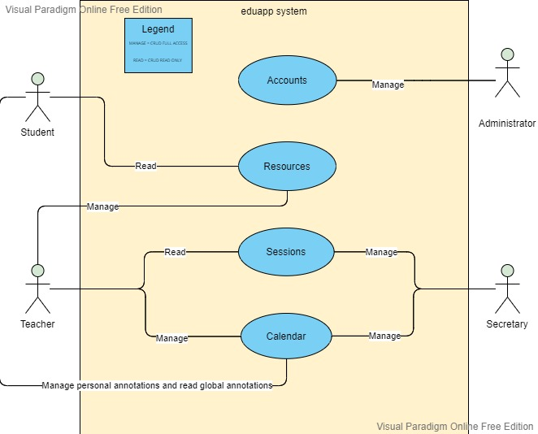

<h1>Usability</h1>
<p>We have used orange and blue as principal colors , then we use a different gray scales and white.</p>
<p>After an intensive search we have found the perfect combination with orange and blue as principal colors, combined with a bolder font weight.</p>
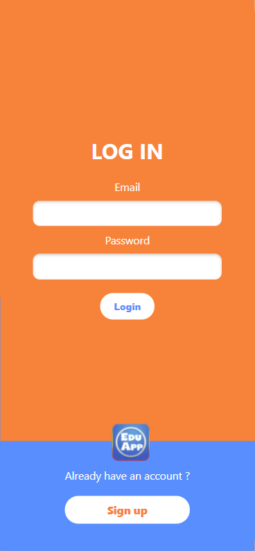
<p>In the sign up form , we have added a advisor in the passwords fields , which gives you feedback if the password it's empty or the confirmation password does not match with the previously written password.</p>
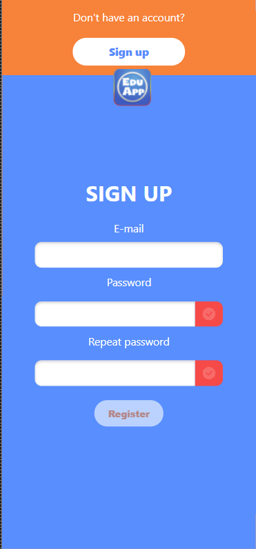
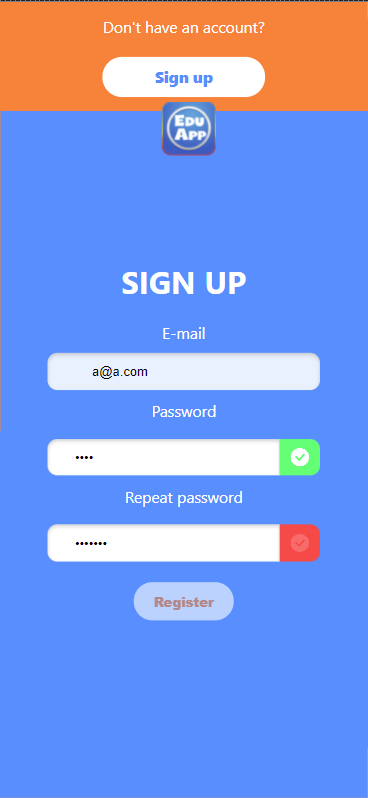
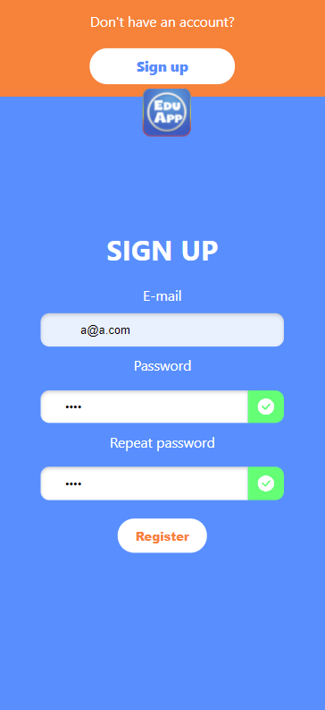
<p>Before the password its written and the confirmation password matches , you aren't able to sign up the account and the submit button were disabled , after the confirmation matches it will be enabled and you can submit and sign up the account.</p>
<p>This is the function which checks if the password it is empty or the confirmation password matches with the previously password field.</p>

```bash
  checkPasswordMatch = () => {
    //Check first password field is not empty
    if (this.state.password.length > 0) {
      this.setState({
        passwordEmpty: false,
      });
      if (this.state.password === this.state.password_confirmation) {
        this.setState({
          passwordMatches: true,
        });
        document
          .getElementById("registration__submit")
          .removeAttribute("disabled");
      } else {
        this.setState({
          passwordMatches: false,
        });
        document
          .getElementById("registration__submit")
          .setAttribute("disabled", true);
      }
    } else {
      this.setState({
        passwordEmpty: true,
      });
    }
    //Check if password_confirmation matches
  };
```
<h2>This app has implemented a full responsiveness, with individual development for mobile and desktop</h2>
<p>In desktop , this is how it looks sign up form:</p>
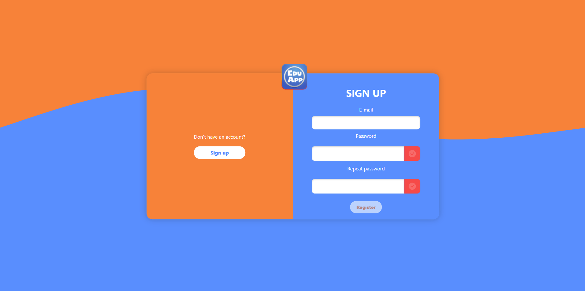
<h2>Mobile view</h2>
<p>Here you can see how the navbar looks , with icon buttons in the bottom of the page becouse it is more easier to users.</p>
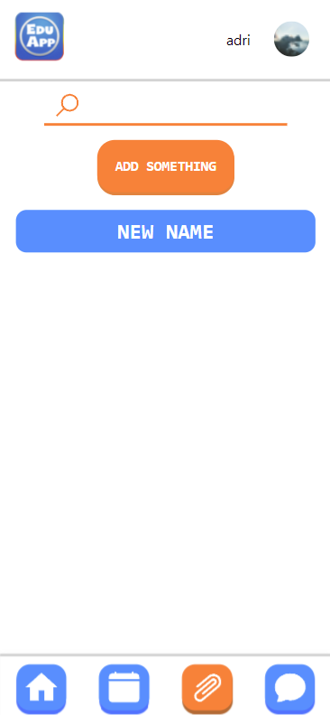
<p>We have decided to change the styles of the navbar buttons, choosing a transparent background, the buttons have a default blue background if you are not in that location, if you click in that button this will change to orange to give you feedback about where you are. </p>
<h3 align="center">Before/After</h3>
<div align="center">
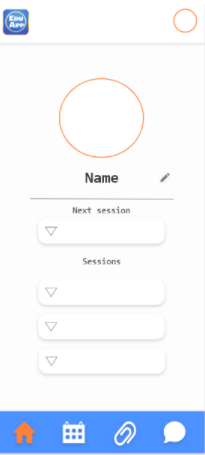

</div>
<h2>Desktop view</h2> 
<p>Here you can see how the navbar looks, placed at the top of the page, the reason why we have decided to change that is becouse in a desktop environment it is more common to see the navbar at the top and text in the buttons instead of icons.</p>
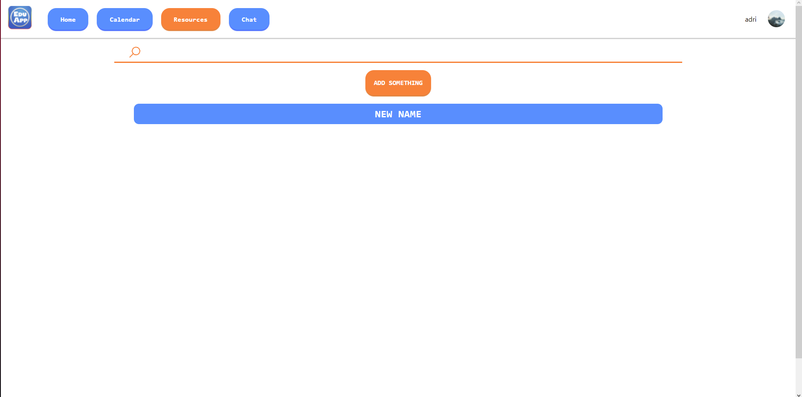
<h2>Eduapp have a dark mode</h2>
<p>The reason why we have decided to implement a dark mode it is becouse in the last time it is very common to see in all the apps.</p>
<p>A dark mode gives you a comfortable experience in situation where the light it is dark, otherwise you force your eyes to see the screen, although this were uncomfortable.</p>
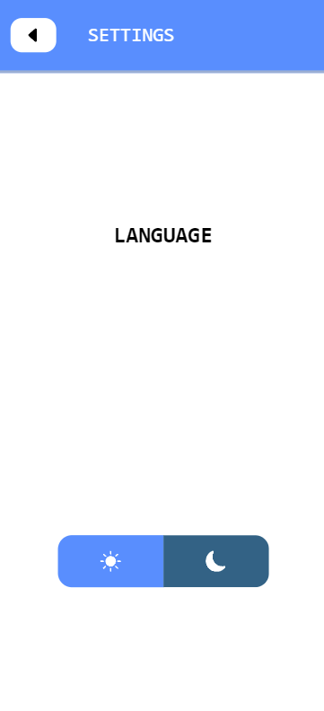
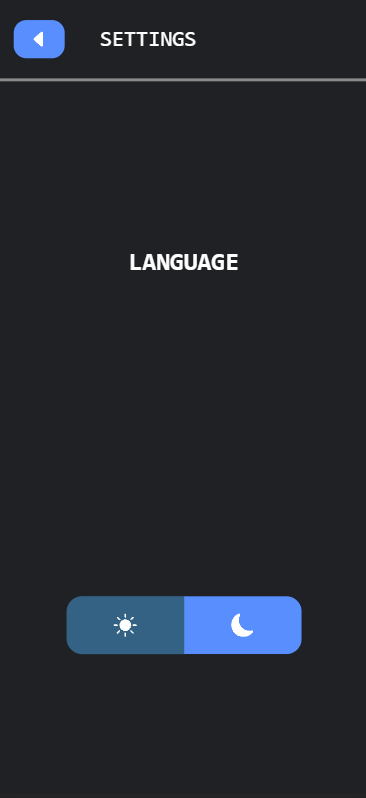
<p>Then the page looks like this</p>
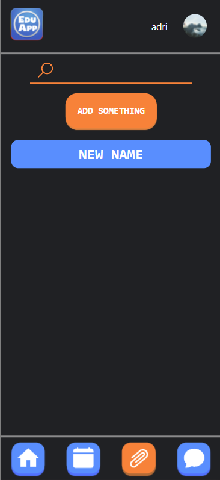

<h2>Loading animation</h2>
<p>When page were loading , an animation will be on screen.</p>
<p>This it's a frame of it , this hole animation was created in pure css.</p>
<p>This gives you feedback when something is loading.</p>
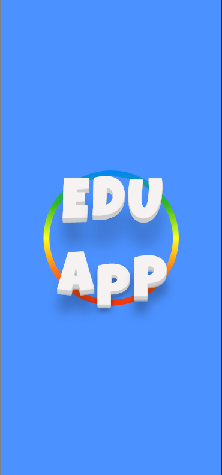

<h1>Tech stack and comparison</h1>
<p>In our case , currently we are developing EduApp as a web app , using a full responsiveness , but we like to make it downloadable , 
making eduapp as a hybrid app.</p>
<div >        
     <a href="https://reactjs.org">
            </a>
   </div>
     
We are using react js as frontend framework , react provides us many advantages , such an easier learning, reusable components, ReactJS is choosing by most developers, becouse it provide us a very rich JavaScript library
<div>
    <a href="https://rubyonrails.org">
        </a>
   </div>
At backend we have decide to use Ruby on rails , which provide us a Model View Controller architecture , a fast development when you know the basics of it , 
a great number of helpful tools and libraries , also it haves many disadvantages , like the price of a mistake , you have to pay attention to all the small details ,otherwise your ruby on rails journey will becomes difficult.

<h1>Docker Mounting</h1>

Mounting to docker is easy, but we need to make some adjustment to Ruby on Rails first.  
Before mounting to docker, we need to first modify the files of ```./backend/eduapp_db/Gemfile``` and ```./backend/eduapp_db/config/database.yml```, changing the following configurations:

```
// Gemfile

ruby '2.6.8' -> ruby '2.6.9'

// database.yml

host: localhost -> host: db
```

After changing these files, go to the root directory and run ```docker-compose up -d``` to mount and start the database, backend api and frontend interface once the mounting completes.  
If you wish to mount only the backend or the frontend, make sure you position yourself inside frontend or backend/eduapp and run the command above, to mount only the corresponding docker-compose.  

Once finished mounting, you must access the API container shell and run the following command to create and migrate the database:  
```
rails db:create
rails db:migrate:reset
``` 

And you will have successfully mounted and deployed EduApp to multiple docker containers!

<h1 id="personal-opinion-and-comparison">Personal opinion and conclusions</h1>
<p>It is a pleasure to us be part of this project , as our first project working in with other people,becoming this project a challenge , we found many difficults in the journey, but we also have learned so much through it,although this it is just the beggining of the project and so much things will happen through the journey.</p>
