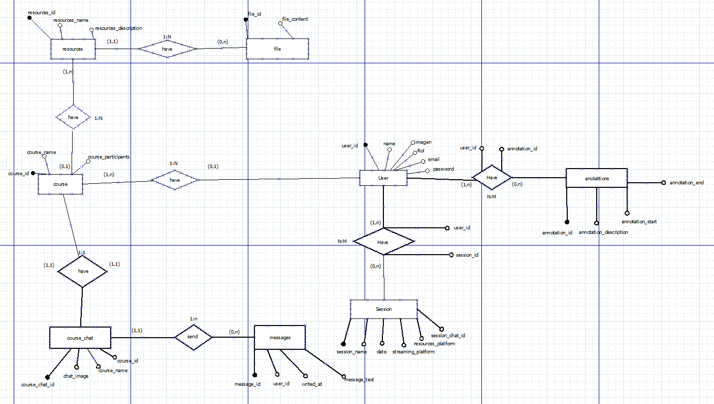
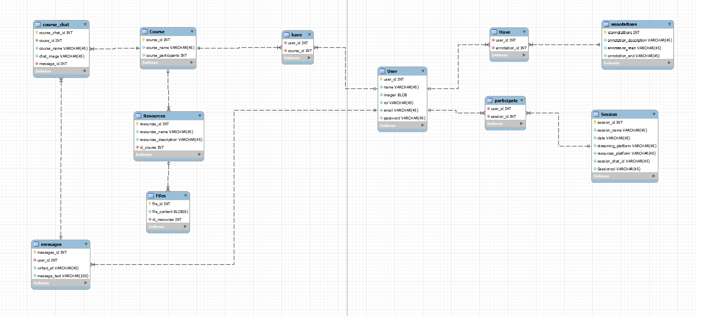

<div align ='center'>
</div>

- [About the project](#about-the-project)
- [Backend](#backend-information)
- [Frontend](#frontend-information)
- [Built with](#built-with)
- [User Requirements](#user-requirements)
- [API Documention](#api-documention)
- [Use Cases](#use-cases)
- [Usability](#usability)


</div>
<h1 align='center'>About the project</h1>
<div >
     Eduapp emerges after the covid 19 pandemic ,as the answer to the challenges that this entails.
     <br/>
     It's an european project , co-funded by erasmus+ programme
     <br/>
          <h1>Partners</h1>
          <p>Fundatia Ecologica Green , Romania , Instituto Politécnico de Santarém , Portugal , Stichting Landstede , Netherlands , SOSU OSTJYLLAND , Denmark and IES El Rincón , Spain</p>
          <h1>Objectives</h1>
          <p>Faciliate and increase the communication between school, students and teachers by developing an application , EduApp , free and open source , customised for each partner school.</p>
   </div>
  
<h1 align='center'>Backend information</h1>
<p>Eduapp has used postgresQL as database, ruby on rails as server-side web application framework.</p>
<h3>Diagram E/R</h3>
<div >
</div>
<h3>Diagram UML</h3>
<div >
</div>
<h3>Relational diagram:</h3>
<div>
    <h4>User and Annotations</h4>
    <p>Annotation(annotation_id, annotation_description, annotation_start, annotation_end )</p>
    <p>USER(user_id,name, image,rol,email,password)</p>
    <p>HAVE(user_id*, annotation_id*)</p>
    <h4>User and session</h4>
    <p>USER(user_id,name, image,rol,email,password)</p>
    <p>SESSION(session_id, session_name, date, streaming_platform, resoruces_platform, session_chat_id)</p>
    <p>PARTICIPATES(user_id*, session_id*)</p>
    <h4>User and Course</h4>
    <p>COURSER(couse_id, course_name, couse_participants)</p>
    <p>USER(user_id,name, image,rol,email,password)</p>
    <p>HAVE(couser_id*, user_id*)</p>
     <h4>Course and Resources</h4>
    <p>COURSE(course_id, course_name, course_participants)</p>
     <p>RESOURCES(resources_id, resources_name, resources_description, id_course*)</p>
     <h4>Resources and files</h4>
     <p>RESOURCES(resources_id, resources_name, resources_description, id_course*)</p>
     <p>FILES(files_id, files_content, id_resources*)</p>
     <h4>Course, messages and course chat</h4>
     <p>COURSER(course_id, course_name, course_participants)</p>
     <p>MESSAGES(messages_id, writer_at, message_text, user_id)</p>
     <p>COURSE_CHAT(course_chat_id, message_id*,chat_image,course_name,course_id*)</p>    
</div>

<h3>Explanation of the diagrams contents:</h3>
<p>-User table is used to register.</p>
<p>-Annotations table is used as a calendar for events to be stored.</p>
<p>-Session table is used to know when you have classes and thei information.</p>
<p>-Course table is used to know the students of a courser.</p>
<p>-Course chat table is used to create a chat for each course or subject.</p>
<p>-Messages table is used to save who send the messages and the contents.</p>
<p>-Resources table are the documents or information about sessions.</p>
<p>-Files table is used to save the documents.</p>
<h3>ORM</h3>
<p></p>
<h3>How to install and run</h3>
<p> First, you must install the programs. Now you have to clone the project and used this commands.</p>
<p>To clone, use:</p>

```bash
git clone https://github.com/eduappdevs/eduapp
cd eduapp/backend/eduapp_db/
bundle install
```

<p>After using these commands, you need to look inside config folder and find database.yml, there you must change the database password and put your postgresQL password , otherwise , the database will not work</p>

<p>To have values in the database enter the following command:</p>

```bash
rails db:migrate
rails db:seed
```

<p>After you have followed these steps, you can start the server with:</p>

```bash
rails s
```

<p>To stop the server you have to use CTRL + C.</p>
<h1 align='center'>Frontend information:</h1>
<p>This is how eduapp started but some visual changes were made.</p>
<details >
<summary>Prototype</summary>
<div >
</div>
<div >
</div>
<div >
</div>
</details>
<h3>How to install and run</h3>
<p> First, you must install the programs. Now you have to clone the project and used this commands.</p>
<p>To clone, use:</p>

```bash
git clone https://github.com/eduappdevs/eduapp
cd eduapp/frontend
npm start
```

<p>To stop the server you have to use CTRL + C.</p>

<h1 >Tech stack</h1>
<div>
    <a href="https://rubyonrails.org">
        </a>
   </div>
  
<div >        
     <a href="https://reactjs.org">
            </a>
   </div>
     
<div >
       <a href="#">
            
     </a>
   </div>
     
<div >
     <a href="#">
            
     </a>
   </div>
     
<div >
     <a href="#">
            
     </a>
   </div>
     
<div >
     <a href="#">
            
     </a>
   </div>
     
     
<div>
     <a href="#">
            
     </a>
   </div>

<h1>User Requirements</h1>
<h2>Platform</h2>
<p>This app are going developing in both platforms, mobile and desktop.</p>
<p>You must to log in or instead sign up if you are not already registered, otherwise you won't have access to the application.</p>
<p>Eduapp has three type of user, it depends on the type your user has more functions or not.</p>
<h3>1. Students user are able to:</h3>
<p>View your account's calendar, resources, upcoming sessions, and chats.</p>
<h3>2. Teacher user are able to: </h3>
<p>They have the same functionality as students, but they can edit, delete, and create events in calendars, resources, and remove students from their classes.</p>
<h3>3. Secretary user are able to: </h3>
<p>They have control over the users of their school.</p>
<h3>4. Administrator user are able to:</h3>
<p>They have the same functionality as secretary, but they has full control over the user of the secretary  of the educational center. </p>

<h1>API Documention </h1>

<a align="left" href="https://documenter.getpostman.com/view/17853818/UVR5qUPn">Resources Database Table</a>
<br/>
<a align="left" href="https://documenter.getpostman.com/view/17853818/UVR5qUPr">User Info Database Table</a>
<br/>
<a align="left" href="https://documenter.getpostman.com/view/17931022/UVR5qUU8">Session Database Table</a>
<br/>
<a align="left" href="https://documenter.getpostman.com/view/17853818/UVR5qUUB"> User Auth Database Table</a>

<h1>Use Cases</h1>


<h1>Usability</h1>
<p>We have used orange and blue as principal colors , then we use a different gray scales and white.</p>
<p>After an intensive search we have found the perfect combination with orange and blue as principal colors, combined with a bolder font weight.</p>

<p>In the sign up form , we have added a advisor in the passwords fields , which gives you feedback if the password it's empty or the confirmation password does not match with the previously written password.</p>


<p>Before the password its written and the confirmation password matches , you aren't able to sign up the account and the submit button were disabled , after the confirmation matches it will be enabled and you can submit and sign up the account.</p>
<p>This is the function which checks if the password it is empty or the confirmation password matches with the previously password field.</p>

```bash
  checkPasswordMatch = () => {
    //Check first password field is not empty
    if (this.state.password.length > 0) {
      this.setState({
        passwordEmpty: false,
      });
      if (this.state.password === this.state.password_confirmation) {
        this.setState({
          passwordMatches: true,
        });
        document
          .getElementById("registration__submit")
          .removeAttribute("disabled");
      } else {
        this.setState({
          passwordMatches: false,
        });
        document
          .getElementById("registration__submit")
          .setAttribute("disabled", true);
      }
    } else {
      this.setState({
        passwordEmpty: true,
      });
    }
    //Check if password_confirmation matches
  };
```
<h2>This app has implemented a full responsiveness, with individual development for mobile and desktop</h2>
<p>In desktop , this is how it looks sign up form:</p>

<h2>Mobile view</h2>
<p>Here you can see how the navbar looks , with icon buttons in the bottom of the page becouse it is more easier to users.</p>

<p>We have decided to change the styles of the navbar buttons, choosing a transparent background, the buttons have a default blue background if you are not in that location, if you click in that button this will change to orange to give you feedback about where you are. </p>
<h3 align="center">Before/After</h3>
<div align="center">


</div>
<h2>Desktop view</h2> 
<p>Here you can see how the navbar looks, placed at the top of the page, the reason why we have decided to change that is becouse in a desktop environment it is more common to see the navbar at the top and text in the buttons instead of icons.</p>

<h2>Eduapp have a dark mode</h2>
<p>The reason why we have decided to implement a dark mode it is becouse in the last time it is very common to see in all the apps.</p>
<p>A dark mode gives you a comfortable experience in situation where the light it is dark, otherwise you force your eyes to see the screen, although this were uncomfortable.</p>


<p>Then the page looks like this</p>


<h2>Loading animation</h2>
<p>When page were loading , an animation will be on screen.</p>
<p>This it's a frame of it , this hole animation was created in pure css.</p>
<p>This gives you feedback when something is loading.</p>


